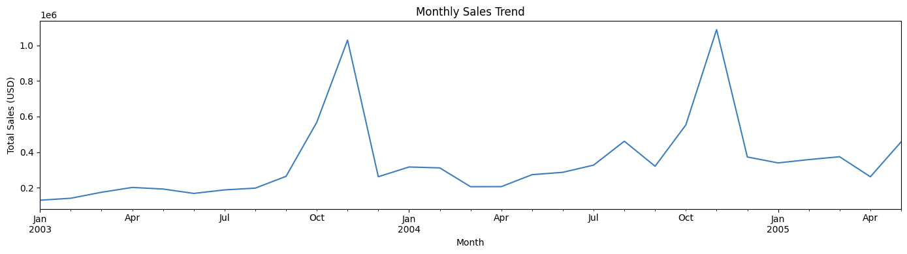
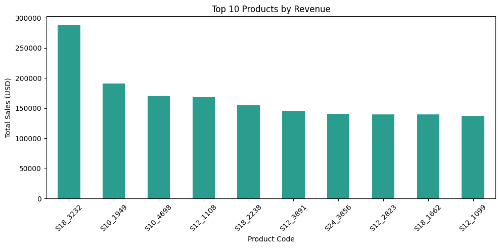
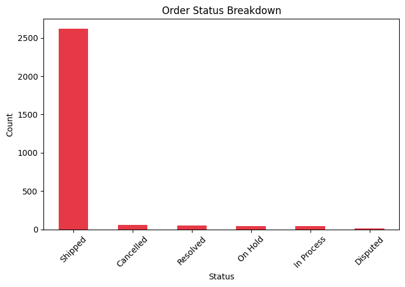

# Sales Data Cleaner & Analytics

Sales dataset cleaning and visual analysis using Pandas and Matplotlib.

## Project Overview

Loads a raw sales CSV, fixes all data quality issues, and generates
three business insight charts.

- **Data cleaning:** Drops irrelevant columns, fills missing values, removes duplicates
- **Date parsing:** Converts raw string dates to datetime format
- **Visualization:** Monthly trend, top products, order status breakdown

## Key Findings

- USA dominates with $3.6M total sales — Spain and France follow
- S18_3232 is the top revenue product
- 92% of orders successfully Shipped — only 2% Cancelled
- Sales peak in October/November each year (Q4 seasonality)

## Charts





## Tech Stack

- Python
- Pandas — data cleaning and aggregation
- Matplotlib — visualization

## Dataset

[Kaggle - Sample Sales Data](https://www.kaggle.com/datasets/kyanyoga/sample-sales-data)

## How to Run

```bash
git clone https://github.com/pallabpodderrobin/sales-data-cleaner.git
cd sales-data-cleaner
pip install pandas matplotlib
python sales_data_cleaner.py
```
